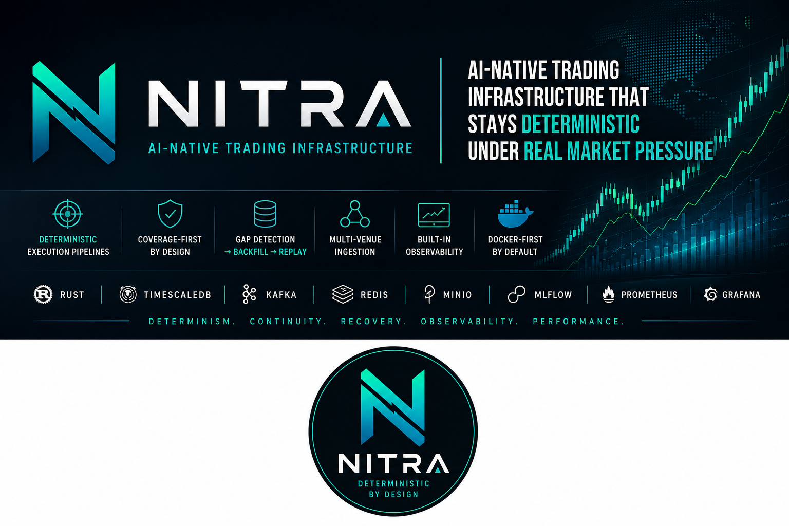

# NITRA



**AI-native trading infrastructure built for deterministic behavior under real market pressure.**

NITRA is a production-oriented, Docker-first platform that combines multi-venue ingestion, deterministic decision pipelines, operator control surfaces, and recovery-first operations in one cohesive system.

## What NITRA Delivers

- Deterministic core runtime for ingestion, replay, risk, execution, and portfolio flows
- Coverage-first data continuity (gap detection -> backfill -> replay)
- Multi-venue market ingestion and canonical normalization
- Native control-panel service with role-aware operations and charting workbench
- Built-in observability and auditability for operational confidence
- CI-ready quality gates and migration controls for safe iteration

## Core Capabilities

- **Market Data Plane**
  - Ingestion connectors and normalization pipeline
  - Canonical market entities and time-series persistence
  - Startup and continuous coverage auditing
- **Deterministic Decision Plane**
  - Structure -> feature -> signal -> risk -> execution -> portfolio chain
  - Policy-traceable decisions and lifecycle-safe execution controls
  - Reconciliation and drift evidence contracts
- **Operations Plane**
  - Control panel domains: overview, ingestion, risk, execution, charting, ops, research, config
  - Role-based privileged actions with audit trails
  - Incident/runbook and deprecation-ready rollout workflows

## Technology Baseline

- Rust for deterministic core services
- Python for probabilistic/AI and supporting services
- TypeScript/JS frontend for control-panel UI shell
- Kafka/Redpanda-style event backbone
- TimescaleDB/Postgres for hot time-series and state contracts
- MinIO + MLflow + Redis + Prometheus + Grafana for platform operations

## Quick Start

```bash
cp .env.example .env
make up
make ps
```

Useful commands:

```bash
make logs
make db
make enforce-section-5-1
make session-bootstrap
```

## Verification and Quality Gates

Primary quality-gate commands:

```bash
make test-dev-0050
make test-dev-0051
scripts/ci/control_panel_refactor_quality_gate.sh
```

These validate backend/frontend contracts, charting cutover safety, and CI readiness.

## Project Structure

- `services/` runtime services (ingestion, deterministic engines, control-panel, charting legacy bridge)
- `infra/` infrastructure bootstrap and schema initialization
- `docs/design/` architecture and LLD source of truth
- `docs/development/` execution board, ticket history, memory, debugging logs
- `tests/` story/epic verification packs and regression gates

## Documentation Entrypoints

- [Docs Home](docs/README.md)
- [Global Ruleset](docs/ruleset.md)
- [Ingestion Ruleset](docs/design/ingestion/ruleset.md)
- [Kanban](docs/development/02-execution/KANBAN.md)
- [Current State](docs/development/04-memory/CURRENT_STATE.md)

## Safety Notice

NITRA is infrastructure software for trading-system engineering.
It is **not** financial advice and does not replace risk/compliance controls required for live trading.
